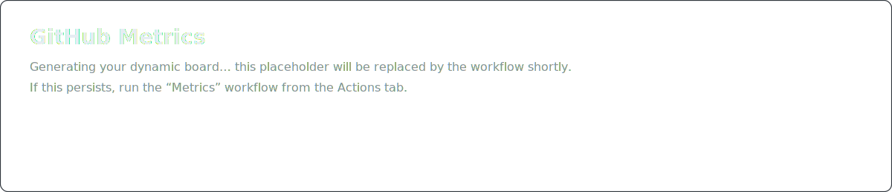

<h1 align="center">Asish Kumar Yeleti</h1>

Mobile App Architect • Flutter & React Native • Backend-inclined

  
  
  
  
  

## About

I design and ship robust mobile experiences with a pragmatic, product-first approach. Strong focus on performance, clean architecture, and developer ergonomics.

## Stack

  

## GitHub Stats

  
Show standard cards (fallback)

   
  

    <table>
      <tr>
        <td>
          
        </td>
        <td>
          
        </td>
      </tr>
      <tr>
        <td colspan="2" align="center">
          
        </td>
      </tr>
    </table>
  

### Profile Summary Cards

  
  
  
  

### Contribution Activity

## Coding Activity (WakaTime)

## LeetCode

  

  (LeetCode/WakaTime are third‑party and may rate-limit)

  
<b>More cards</b> (GitHub Trophies)

   
  

    
  

## Connect

- LinkedIn: https://www.linkedin.com/in/asishkumaryeleti
- GitHub: https://github.com/noiseless47
- Instagram: https://www.instagram.com/asish.k.y

Note: LeetCode and WakaTime usernames are assumed to be "noiseless47". If different, update the links accordingly.
