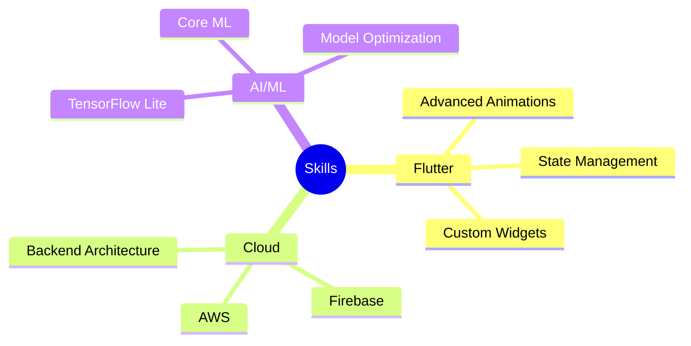

# Mobile App Architect & Code Artisan 🎨

## 🎯 Mission Statement

> Building tomorrow's mobile experiences, one line of code at a time.

## 🛠️ Tech Arsenal

### 📱 Mobile Development

### ⚡ Backend & Cloud

### 🎨 UI/UX Tools

## 🌟 Spotlight Projects

<table>
  <tr>
    <td align="center">
      
       
      <b>Super App</b>
       
      Flutter • Firebase
    </td>
    <td align="center">
      
       
      <b>AI Assistant</b>
       
      React Native • AWS
    </td>
    <td align="center">
      
       
      <b>IoT Dashboard</b>
       
      Flutter • Node.js
    </td>
  </tr>
</table>

## 📈 GitHub Analytics

## 🎯 Current Focus

## 💡 Did You Know?

| Fun Fact | Description |
|----------|-------------|
| 🏃‍♂️ Daily Routine | 1000 lines of code & 2 cups of coffee |
| 🎮 Gaming Setup | PS5 & Custom PC Build Enthusiast |
| 🌍 Travel Goal | Code from every continent |
| 🎵 Coding Playlist | Lo-fi Beats & Synthwave |

## 🤝 Let's Connect!

---

### 📊 Real Coding Activity

<!-- If you prefer manual stats based on your git commits -->

<!-- For detailed contribution graph -->

